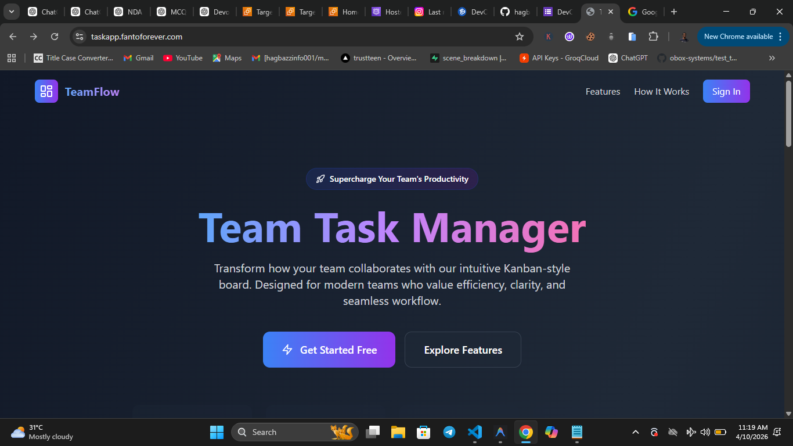
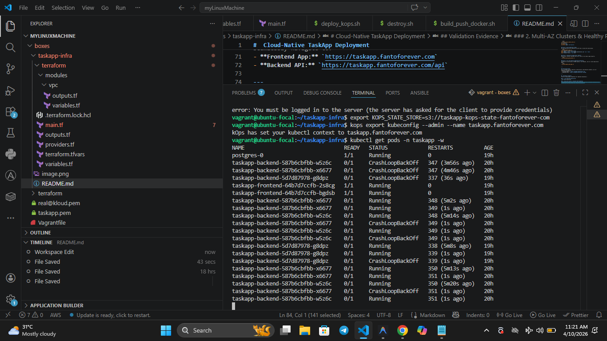

#  Cloud-Native TaskApp Deployment 

Welcome to the ultimate Cloud-Native Capstone Project! This repository contains the complete Infrastructure-as-Code (IaC), Kubernetes Manifests, and Deployment scripts used to orchestrate a highly available, production-ready web application on AWS.

## Technical Architecture

- **Cloud Provider:** Amazon Web Services (AWS)
- **Infrastructure as Code:** Terraform
- **Container Orchestrator:** Kubernetes (Provisioned natively via Kops)
- **Ingress & TLS:** NGINX Ingress Controller + Cert-Manager (Let's Encrypt)
- **Container Registry:** DockerHub

### High Availability (HA) Highlights
1. **Multi-AZ Network:** The VPC seamlessly spans across 3 distinct AWS Availability Zones (`us-east-1a`, `1b`, `1c`) ensuring catastrophic AZ failure resilience.
2. **Private Topology:** Worker nodes and databases are deeply nested inside strictly Private Subnets. Outbound internet bridges natively through isolated NAT Gateways.
3. **Redundant Control Plane:** 3 Master nodes (t3.small) and 3 Worker nodes (t3.small) govern the application workload.
4. **Resilient Data:** PostgreSQL operates identically as a `StatefulSet` tied persistently to AWS Elastic Block Store (EBS) `gp3` volumes.

---

##  Repository Structure

* `terraform/` - Core Terraform Modules (VPC, IAM Kops Roles, DNS, Outputs).
* `kops/` - The fully generated Free-Tier (`t3.small`) optimized Kubernetes topology mappings.
* `k8s/` - The literal Kubernetes manifest payload (Zero-Downtime Deployments, StatefulSets, Ingress).
* `scripts/` - Automated Bash pipelines used sequentially to synthesize the cluster.
* `docs/` - Extensive documentation diving into Cost Analysis, Runbook operations, and Architecture.
* `taskapp_backend/` - Python Flask/Gunicorn API codebase & Dockerfile.
* `taskapp_frontend/` - React/Vite UI codebase & Multi-stage Nginx Dockerfile.

---

##  Deployment Instructions

Following the **[Runbook (`docs/runbook.md`)](docs/runbook.md)**, below is the absolute deployment lifecycle:

### Step 1: Provision Infrastructure (Terraform)
Launch the foundational subnets and network mappings:
```bash
./scripts/setup_remote_state.sh
cd terraform
terraform init
terraform apply -auto-approve
```

### Step 2: Build Kubernetes (Kops)
Use the generated IAM credentials and VPC IDs to launch EC2 node groups:
```bash
./scripts/deploy_kops.sh
kops replace -f kops/cluster.yaml
kops update cluster --name taskapp.fantoforever.com --yes --admin
kops validate cluster --wait 10m
```

### Step 3: Containerize Application (Docker)
Build local container payloads and mirror them to the remote image registry:
```bash
./scripts/build_push_docker.sh
```

### Step 4: Fire The Payload (Kubernetes Manifests)
Automate the installation of NGINX Ingress, Cert-Manager, and our custom Application Pods:
```bash
./scripts/deploy_k8s_apps.sh
```

---

## Verification URLs
Once the NGINX Ingress registers an AWS Elastic Load Balancer globally, you can seamlessly navigate to:
- **Frontend App:** `https://taskapp.fantoforever.com`
- **Backend API:** `https://taskapp.fantoforever.com/api`

---

##  Validation Evidence
*Proof of deliverable completion for Capstone evaluation.*

### 1. Live HTTPS Web Application


### 2. Multi-AZ Clusters & Healthy Pod Validation

### 3. Terraform State & Kops Validation 
.png>)

---

##  Cleanup Procedures
To safely teardown resources and prevent further AWS billing, securely execute the automated termination script:
```bash
./scripts/destroy.sh
```

---

*Author: Owolabi Agbabiaka (Cloud & DevOps Engineer)*
